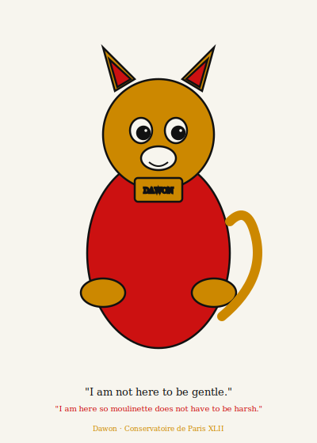

<<<<<<< ours
# Dawon

Dawon is a super mini-moulinette for 42 school piscine exercises —
stricter than mini-moulinette, faster than waiting for the real thing.

Named after [Dawon](https://en.wikipedia.org/wiki/Dawon), the tiger
vahana of Mahadurga — guardian, merciless, thorough.

---

## What it does

Dawon runs a six-layer check pipeline on each exercise:

| Step | Check | Tool |
|------|-------|------|
| 1 | Norminette | `norminette` subprocess |
| 2 | Symbol present | `libloading` (student `.so`) |
| 3 | Forbidden functions | regex + `nm -u` symbol table |
| 4 | Syntax | `cc -Wall -Wextra -Werror -fsyntax-only` |
| 5 | Harness | fork + pipe, SHA-256 with ASAN/UBSAN |
| 6 | Memory | `valgrind --leak-check=full` |

The harness tests edge cases moulinette does not: `INT_MIN`,
null bytes (`'\0'`), DEL (127), and all C(10,3) / C(100,2)
combinations for `ft_print_comb` / `ft_print_comb2`.

---

## Install

```bash
cargo install --git https://github.com/qlrd/dawon
```

Or build from source:

```bash
git clone https://github.com/qlrd/dawon
cd dawon
cargo build --release
# binary at: target/release/dawon
```

---

## Usage

### Check your own submission

```bash
dawon check --path /path/to/C00
dawon check --path /path/to/C00 --exercise ex00
```

### Check a friend's submission

```bash
dawon friend --login aguiar    # looks in /home/aguiar/C00
dawon friend --login aguiar --module C01 --exercise ex01
dawon friend --path /path/to/friend/C00
```

### Flags

```
--no-sanitizers   skip ASAN/UBSAN (step 5 uses plain cc)
--no-valgrind     skip valgrind (step 6)
```

---

## Configuration

Create `.gato.toml` in the module directory to override defaults:

```toml
[forbidden]
functions = ["printf", "malloc", "free"]

[checks]
no_sanitizers = false
no_valgrind   = false
```

If `.gato.toml` is absent, Dawon uses safe defaults (empty forbidden
list, all checks enabled).

---

## Output

```
════════════════════════════════════════════════════════════
  DAWON  super mini-moulinette
  Tiger of Mahadurga · Stricter than mini-moulinette
════════════════════════════════════════════════════════════

  Evaluating: myself  /home/student/C00

────────────────────────────────────────────────────────────
  ex00 — ft_putchar
  Write a function that outputs a char to stdout.
────────────────────────────────────────────────────────────
  [1/6] Norminette                             PASS
  [2/6] Symbol: ft_putchar                     PASS
  [3/6] Forbidden functions                    PASS
  [4/6] Compiler                               PASS
  [5/6] Harness (ASAN/UBSAN)                   PASS
  [6/6] Valgrind                               PASS

  Summary: 6/6 passed

════════════════════════════════════════════════════════════
  GRAND SUMMARY
════════════════════════════════════════════════════════════
  ex00 (ft_putchar)   6/6
════════════════════════════════════════════════════════════
  6/6 checks passed
════════════════════════════════════════════════════════════
```

---

## Subjects

| Exercise | Function | Edge cases |
|----------|----------|------------|
| ex00 | `ft_putchar` | null byte, DEL (127) |
| ex01 | `ft_print_alphabet` | full a–z output |
| ex02 | `ft_print_reverse_alphabet` | full z–a output |
| ex03 | `ft_print_numbers` | full 0–9 output |
| ex04 | `ft_is_negative` | `INT_MIN`, 0, positive |
| ex05 | `ft_print_comb` | C(10,3) = 120 combinations |
| ex06 | `ft_print_comb2` | C(100,2) = 4950 pairs |
| ex07 | `ft_putnbr` | `INT_MIN`, 0, negative, max |
| ex08 | `ft_print_combn` | n=1 (digits), n=3 (=ft_print_comb) |

---

## Development

```bash
cargo build
cargo test
cd tests/python && uv run pytest
```

Fuzz (nightly required):

```bash
cargo +nightly fuzz run fuzz_forbidden
cargo +nightly fuzz run fuzz_config
```

See [CONTRIBUTING.md](CONTRIBUTING.md) for the full workflow.

---

## Relationship to monsieur-ganesha

[monsieur-ganesha](https://github.com/qlrd/monsieur-ganesha) is the
primary pre-commit hook suite for the piscine. Dawon is an optional
experimental companion: if mini-moulinette is unavailable or fails,
Dawon runs instead.

They are independent binaries. Dawon does not depend on
monsieur-ganesha and vice versa.

---

## Mascot and lore

<p align="center">
  
</p>

**Dawon** is the divine lion (or tiger) who carries Mahakali into
battle. Ancient, patient, and absolutely merciless when the test
suite demands it.

In the lore of this project, Dawon is the inspector who arrives
after Mademoiselle Norminette has already made her first pass.
Where Norminette is strict about style, Dawon is strict about
*correctness* — she does not care how elegant your code looks if
`INT_MIN` makes it crash.

> *"I am not here to be gentle.*
> *I am here so moulinette does not have to be harsh."*
>
> — Dawon, Conservatoire de Paris XLII

The mascot illustration (`assets/mascot.svg`) depicts Dawon in
her inspector uniform: powerful, elegant, wearing the badge of the
Conservatoire. She reviews your submission with absolute focus.

---

## License

[MIT](LICENSE)
=======
# dawon
Super mini-moulinette, stricter than moulinette
>>>>>>> theirs
